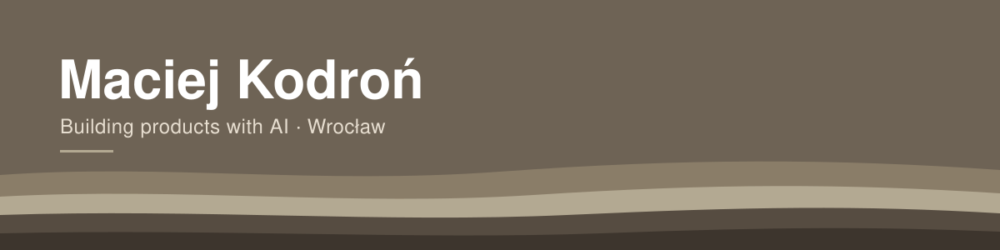

### Hi, I'm Maciek

Applied Computer Science student at Wrocław University of Science and Technology. I design products and build them with AI – from a sketch to an app that actually runs. None of my projects has a paying customer yet, but they all run, and I can explain every decision behind them.

### What I'm building

**Cuzca** – a climbing gym platform for the Polish market  
A mobile app for climbers and a web admin panel for gym owners. Streaks as cairn piles, rewards as a chalk bag, rank tiers as rock strata, a competition mode designed around the judge.  
Expo / React Native · Next.js · Firebase  
→ [Try me](cuzca.pl)

### Tools

TypeScript · React · React Native / Expo · Next.js · Astro · Firebase · Cloudflare Pages  
Figma · FigJam · Notion · Claude Code

### Outside the screen

Bouldering (the reason Cuzca exists), guitar and music production, strength training.

### Contact

kontakt@cuzca.pl · Wrocław, Poland
